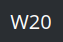

# plasma6-weeknumber

Simple plasmoid to show the current week number.

Based on [plasma-weeknumber](https://github.com/anselmolsm/plasma-weeknumber) with changes:
- ported to Plasma 6
- update the week number when the week changes

Ways to install:
- From Plasma "Add graphical components / Download additional graphical components"
- Download from the [KDE Store](https://store.kde.org/p/2289034)
- Clone the repo and run `task install` or `kpackagetool6 -t Plasma/Applet -i .`
